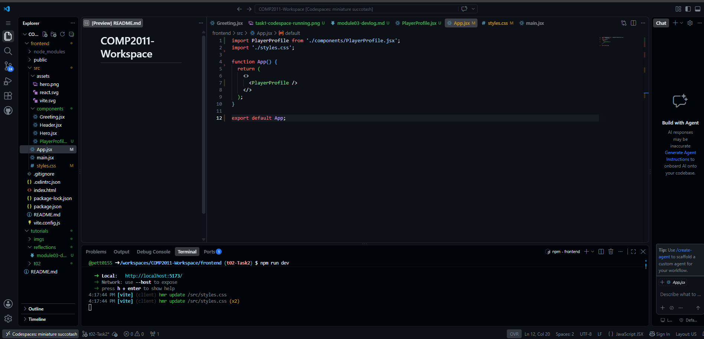

# Module 03 Devlog

## Module 2 Devlog

### 1. Proof of completion



*Figure 1: The completed Task 2 practical work running successfully in the Codespace.*

- **Task 2 completed successfully:** **Yes**
- **Brief description:** The screenshot shows the completed React application running successfully in the Codespace. The application displays the Player Profile with the username "PixelPioneer" and the current level of 5. The custom CSS styling is also applied successfully.

### 2. Concept mapping

- **Concept 1: React components**
  - **Lecture slide:** Not specified in the task instructions.
  - **Description:** React components allow an application to be divided into smaller reusable parts. A component can contain its own JavaScript logic and JSX that describes what should appear on the page.
  - **Implementation:** I created a `PlayerProfile` component in `PlayerProfile.jsx` and imported it into `App.jsx`. The `App` component then renders the `PlayerProfile` component using `<PlayerProfile />`.

```jsx
import PlayerProfile from './components/PlayerProfile.jsx';

function App() {
  return (
    <>
      <PlayerProfile />
    </>
  );
}

export default App;