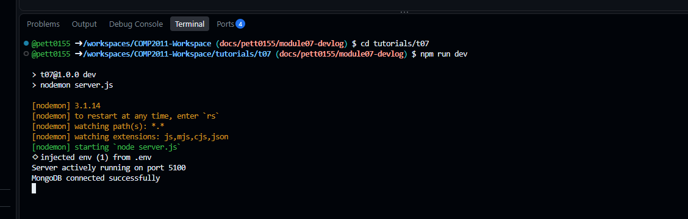
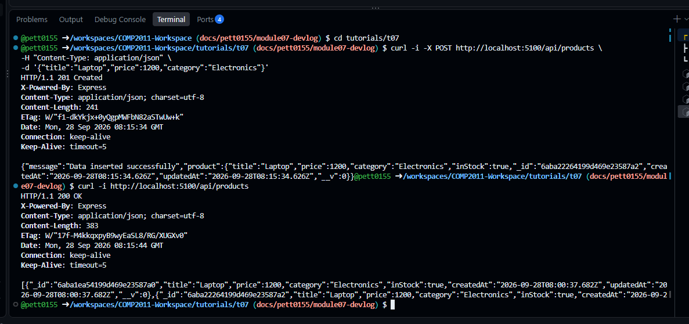
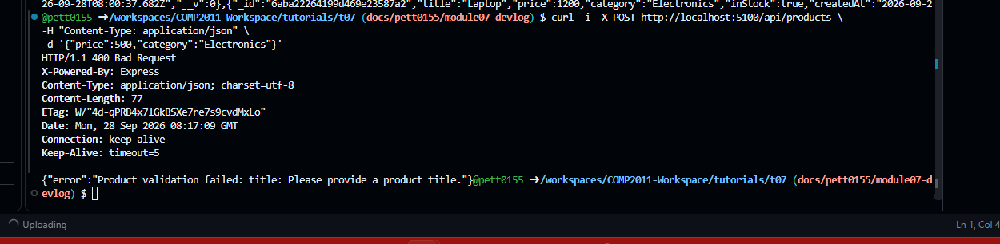

# Module 7 Devlog

## 1. Proof of Completion

- Practical work completed: Yes
- Extension task: No

### Evidence



The Express server started successfully and connected to MongoDB using the environment variable.



The POST request created a product with `201 Created`, and the GET request retrieved the saved products with `200 OK`.



The API returned `400 Bad Request` when the required product title was missing, showing that Mongoose validation was working.

## 2. Concept Mapping

### MongoDB Connection and Environment Variables

**Lecture slides:** MongoDB connection and `.env`

I used an environment variable to store the MongoDB connection string instead of putting it directly in the server code. The server loads the value using `dotenv` and connects to MongoDB using Mongoose.

```javascript
import dotenv from 'dotenv';
dotenv.config();

const connectDB = async () => {
    try {
        await mongoose.connect(process.env.MONGO_URI);
        console.log("MongoDB connected successfully");
    } catch (error) {
        console.log("MongoDB connection failed:", error.message);
        process.exit(1);
    }
};